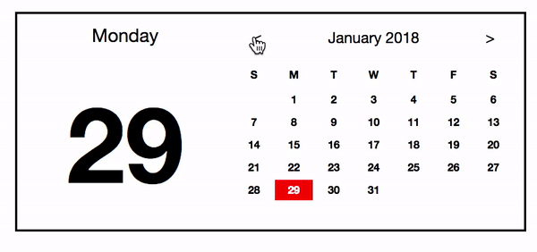

# calendar-todo-project
Vanilla JS로 캘린더 + todo list 만들기  

## 구현 목록

1. 달력 UI는 이미지와 똑같이 한다.

2. 달력의 기능도 이와 똑같이 한다.
   1. 처음 화면은 현재 달이 나온다.
		* 현재 날짜나, 클릭한 날짜는 빨간색으로 나온다.
   2. 왼쪽에 요일과 일이 나온다.
   3.  월과 년을 나타내는 자리에 왼쪽과 오른쪽 화살표로 월을 이동한다.
		* 꾹 눌렀을 때는 빠르게 이동한다.
3. 하단에는 **Todo List**가 나온다. [참조Ul](http://todomvc.com/examples/vue/)
	1. 탭은 3개다. All / Active / Completed
		* All이 기본 탭이다.
		* All: 진행형 완료형 전부 볼 수 있다.
		* Active: 진형형만 볼 수 있다. 
		* Completed: 완료형만 볼 수 있다.
	1. 추가 삭제 가능 
		* 추가는 Enter로 한다.
	1. 아이템 개수가 나온다.
	1. 완료시 화면에서 보이지 않는다.
		* 아이템 개수에 포함되지 않는다.
		* Completed 탭에서 확인 가능하다.
	1. Clear completed를 클릭하면 완료한 항목을 삭제 한다.

   
   
      